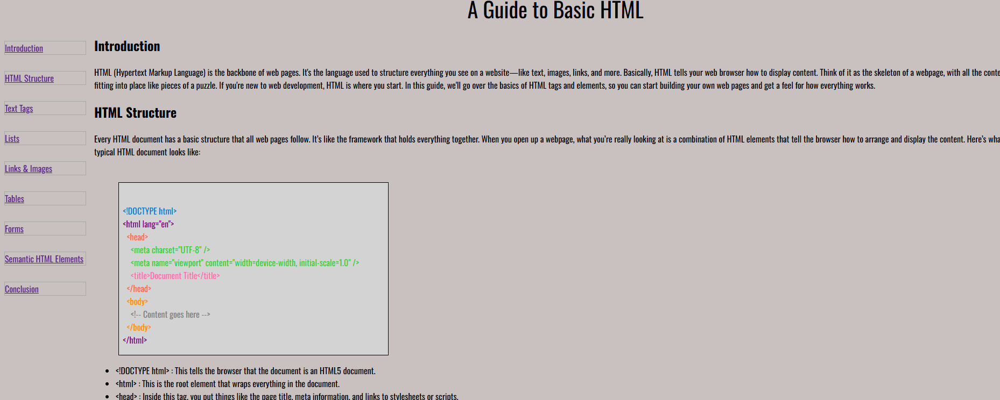

# Technical Documentation Page

This is a **Technical Documentation Page** I created as part of the [Responsive Web Design Certification](https://www.freecodecamp.org/learn/responsive-web-design/) on **freeCodeCamp**.

##  Project Description

The page provides a beginner-friendly overview of basic HTML elements and their use. It includes clearly organized sections covering:

- Introduction to HTML
- HTML Structure
- Text Tags
- Lists (Ordered & Unordered)
- Links & Images
- Tables
- Forms
- Semantic HTML Elements
- Conclusion

Each section is accessible through a sticky vertical navigation menu for easy browsing.

##  Objective

- Practice HTML and CSS layout skills  
- Implement semantic HTML elements  
- Build a responsive, accessible, and readable documentation layout  

## Features

- Clean and readable layout  
- Responsive design  
- Semantic HTML structure  
- Easy navigation with internal links  

##  Technologies Used

- HTML5  
- CSS3  
- Google Fonts  

##  freeCodeCamp User Story Coverage

This project fulfills all the user stories for the **"Build a Technical Documentation Page"** project in the Responsive Web Design Certification.

##  Screenshot

## How to Use

1. Clone this repository  
2. Open `index.html` in your browser  

## Acknowledgments

- Thanks to [freeCodeCamp](https://www.freecodecamp.org/) for the curriculum and project guidance.

---
